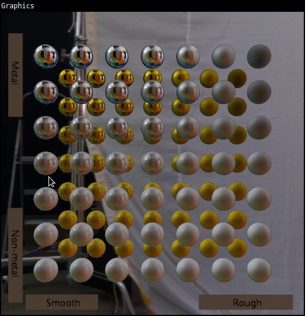
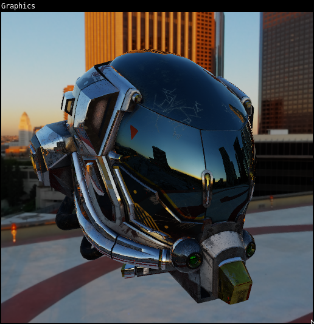

# Psychotronic Graphics
Realtime 3D graphics renderer.

## Features
### Lighting
* [x] Physically-based rendering (PBR)
* [x] Image-based lighting (IBL)
* [ ] Reflection probes
* [ ] Shadow mapping
* [x] Skybox
### Acceleration
* [x] Frustum culling
* [ ] Occlusion culling
* [ ] Clustered forward rendering
